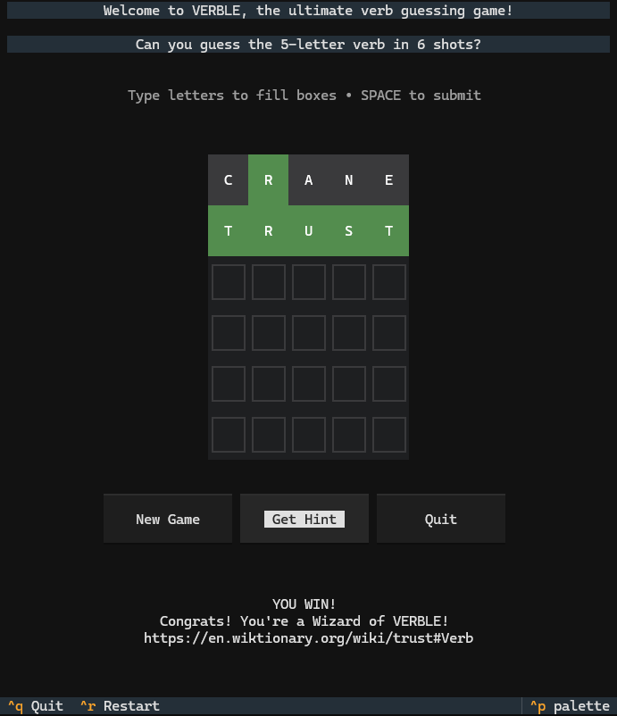

**Verble V2** is a command-line adaptation of the popular Wordle game, with a primary focus on verbs and occasional inclusion of nouns.

---

## Download

The game is continuously built using GitHub Actions. You can download the latest version directly from the [Releases](https://github.com/ManjunathNReddy/Verble-V2/releases) section and run it - No installation needed!

---
## How to Play

- You have six attempts to guess a five-letter verb. Words may contain repeated letters.
- After each guess, letters are color-coded:
  - **Green**: Correct letter in the correct position.
  - **Yellow**: Correct letter in the wrong position.
  - **Grey**: Letter is not in the target word.
---

## Installation from Source

To install and run the game from source using Conda:

1. Clone the repository.
2. Install [Miniconda](https://docs.conda.io/en/latest/miniconda.html) if not already installed.
3. Open a terminal and run the following command:
   ```bash
   conda create --name <env> --file requirements.txt
   ```
4. Activate the environment:
   ```bash
   conda activate <env>
   ```
5. Start the game:
   ```bash
   python src/main.py
   ```

---


## Data Sources

- The "complete" verb list is sourced from [Ashley Bovan's parts of speech resource](http://www.ashley-bovan.co.uk/words/partsofspeech.html).
- The "most frequent" verbs are derived from [Google's N-gram corpus](http://storage.googleapis.com/books/ngrams/books/datasetsv2.html).